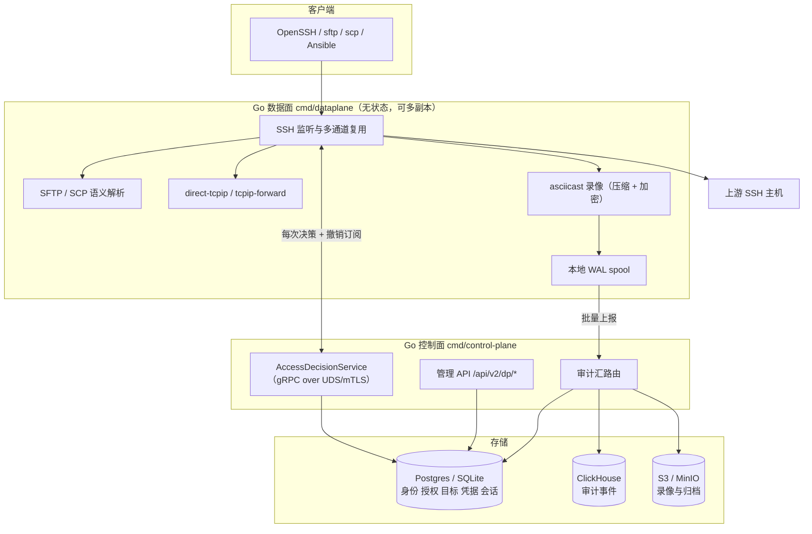

# 架构：数据库为准的 SSH 审计代理

本文描述当前架构。旧的 C 数据面（`src/`）仍可构建，但新部署应使用 Go 数据面，
两者的差异见文末「为什么替换 C 数据面」。

## 分工



数据面持有套接字、搬运字节、捕获发生了什么。**任何可能授予或扩大访问权限的判断都不在
数据面做**，而是在需要它的那一刻向控制面提问，对着数据库回答。这条分界带来两个直接结果：

- 撤销在下一次决策时生效，而不是下一次配置重载。
- 凭据材料不落在面向不可信客户端的进程里。

## 决策点会被问到什么

数据面在这些时刻发起 gRPC 调用（`api/proto/auditproxy/v1/access.proto`）：

| 时机 | 调用 | 拒绝的后果 |
|---|---|---|
| 客户端认证 | `Authenticate` | 连接被拒 |
| 解析目标、决定能力 | `AuthorizeSession` | 连接被拒，并告知原因 |
| 每个通道与通道请求 | `AuthorizeChannel` | 该通道被拒，会话继续 |
| 每条命令 | `AuthorizeCommand` | 命令在到达上游之前被挡下 |
| 上游 host key | `ResolveHostKey` | 拒绝连接上游 |
| 上游登录凭据 | `IssueUpstreamCredential` | 无法连接上游 |
| 会话开始/心跳/结束 | `OpenSession` / `Heartbeat` / `CloseSession` | 并发限额、超时、跨节点踢人 |
| 审计事件 | `ReportEvents`（客户端流） | 事件留在本地 spool 重试 |

`AuthorizeCommand` 是服务端流：命中需要审批的规则时，第一条消息告诉数据面会话正在等待
（用户会看到提示而不是卡住），第二条带回审批结果。

## 数据库是唯一事实源

`dp_*` 表（`internal/store`，Postgres 与 SQLite 双方言）：

- `dp_users` / `dp_user_public_keys` — 身份与公钥
- `dp_roles` / `dp_role_bindings` — 角色
- `dp_targets` / `dp_target_host_keys` / `dp_host_ca_keys` — 目标与 host key 信任
- `dp_target_credentials` / `dp_secrets` — 上游凭据（信封加密，密文入库）
- `dp_access_rules` — 授权规则（能力掩码、源网段、时间窗、TTL、并发、录像策略）
- `dp_command_policies` / `dp_command_rules` — 命令策略
- `dp_ip_rules` — 源网络放行/阻断
- `dp_sessions` — 会话（共享，任意节点可枚举与终止）

策略求值 **fail closed**：没有规则匹配的请求被拒绝。授权策略写错不应该等于开放访问。

`config.ini` 降级为可选的引导来源，用 `audit-proxy migrate ini2db` 导入。导入保留语义：
旧的 `port_forward` 关键字覆盖本地/远程/动态三种转发，因此映射到三者；没有匹配策略的路由
保留旧数据面的宽松行为，但显式写进规则而不是留作隐式默认；通配路由排在具体路由之后。
`$6$`/`$5$` crypt 口令可继续登录，并在首次登录时升级为 argon2id。

## 快速上手

### 1. 准备密钥与数据库

```bash
# 主机密钥：不要让代理每次启动自己生成，否则用户会被训练成忽略主机密钥告警
ssh-keygen -t ed25519 -f /etc/audit-proxy/host_key -N ""

# 凭据信封加密密钥、审计链密钥、录像加密密钥
openssl rand -hex 32   # secrets_encryption_key
openssl rand -hex 32   # audit_chain_key（控制面与所有数据面节点必须一致）
openssl rand -hex 32   # recording-encryption-key
```

### 2. 控制面配置

```json
{
  "listen_addr": ":8443",
  "session_secret": "…",
  "data_dir": "/var/lib/audit-proxy",
  "audit_log_dir": "/var/log/audit-proxy",

  "pdp_listen_addr": "unix:/run/audit-proxy/pdp.sock",
  "secrets_encryption_key": "file:/etc/audit-proxy/secrets.key",
  "audit_chain_key": "file:/etc/audit-proxy/chain.key",

  "postgres_database_url": "postgres://…",
  "audit_store_backend": "clickhouse",
  "audit_store_database_url": "clickhouse://ch:9000/audit",
  "audit_retention_days": 365
}
```

决策点默认监听 unix socket 且权限 0660。任何能调用它的东西都能拿到上游凭据，
所以它不应该和 Web 控制台在同一个可达面上。

### 3. 从 config.ini 导入（可选）

```bash
audit-proxy migrate ini2db \
  --config /etc/audit-proxy/config.ini \
  --driver postgres --dsn "$DSN" \
  --encryption-key file:/etc/audit-proxy/secrets.key \
  --dry-run          # 先看报告，再去掉 --dry-run 实际写入
```

导入结束会列出无法忠实迁移的项，逐条处理，不要忽略。

### 4. 启动数据面

```bash
dataplane \
  --node-id "$(hostname)" \
  --listen 0.0.0.0:2222 \
  --host-keys /etc/audit-proxy/host_key \
  --pdp unix:/run/audit-proxy/pdp.sock --pdp-insecure \
  --fail-mode closed \
  --audit-chain-key file:/etc/audit-proxy/chain.key \
  --recording-encryption-key "$RECORDING_KEY" \
  --metrics-addr 127.0.0.1:9100
```

`--pdp-insecure` 只允许用于本机 unix socket；跨机必须配 mTLS 客户端证书。

### 5. 配置一个目标

```bash
# 目标
curl -X POST …/api/v2/dp/targets -d '{"name":"web-1","host":"10.0.1.10","port":22}'

# 上游凭据（secret 只写不读）
curl -X POST …/api/v2/dp/credentials \
  -d '{"target_name":"web-1","login":"deploy","kind":"ca_cert"}'

# 授权规则
curl -X POST …/api/v2/dp/rules -d '{
  "name":"SRE 访问生产","priority":20,
  "subject_kind":"role","subject":"sre",
  "target_selector":"tag:env=prod",
  "upstream_logins":["deploy"],
  "features":["shell","exec","pty","env","sftp","download"],
  "denied_features":["agent_forward"],
  "max_session_ttl":"8h","idle_timeout":"15m",
  "max_concurrent_sessions":3,
  "record_policy":"full"
}'

# 上线前先问「如果某人现在连过去会怎样」
curl -X POST …/api/v2/dp/rules/evaluate \
  -d '{"username":"alice","target":"web-1","upstream_login":"deploy"}'
```

客户端连接格式：`ssh <principal>%<上游账号>@<目标> -p 2222 <代理地址>`，
也可以只写 `<principal>@<目标>`（上游账号由策略决定）或 `<principal>`（目标由策略决定）。

### 6. 首次连接会被拒绝

这是正确行为。目标的 host key 未被信任时代理不会连接——否则录下来的会话无法证明
对端就是目标本身。审批队列：

```bash
curl …/api/v2/dp/host-keys/pending
curl -X PUT ".../api/v2/dp/targets/web-1/host-keys/$FINGERPRINT" -d '{"status":"trusted"}'
```

## 能力（feature）

授权规则用能力名而不是位掩码，这样规则在 API 响应、diff 和审计记录里都可读。
`GET /api/v2/dp/features` 列出全部：

`shell` `exec` `pty` `env` `subsystem` `sftp` `scp` `upload` `download`
`local_forward` `remote_forward` `dynamic_forward` `x11` `agent_forward`

`upload`/`download` 与协议分开：允许 `sftp` 但不允许 `upload`，用户可以取文件但不能放文件，
删除和重命名同样算作修改，需要 `upload`。

规则里写错的能力名会被**拒绝**而不是忽略——静默丢弃会产生一条比作者意图更宽松或更严格的规则。

## 审计

数据面产生的事件先落本地 spool 再上报。会话不会因为控制面慢而卡住，记录也不会因为
控制面宕机期间重启而丢失——那恰恰是最需要解释的时间段。spool 超出预算时丢弃最旧的段
并计数：代理把磁盘写满会彻底停止服务，比丢掉长时间故障中最早的记录更糟。

事件类型：`session.start` `session.end` `session.denied` `channel.denied`
`command` `command.blocked` `file.transfer` `file.operation` `port.forward`
`auth.success` `auth.failure`。**拒绝同样产生事件** —— 被拒的会话、通道、命令、传输
至少和成功的一样值得记录。

每条记录带自身摘要和上一条的摘要。校验：

```bash
curl "…/api/v2/audit/verify?from=2026-01-01T00:00:00Z"
```

链断裂返回 409 而不是 200，便于直接对状态码告警。未配置 `audit_chain_key` 时只校验
链接关系（能发现删除和重排），响应会明确说明这一点——通过的结果不该被理解为超出它实际检查的范围。

## 可观测性

`--metrics-addr` 暴露 `/metrics`、`/healthz`、`/readyz`。指标刻意侧重**拒绝**而非吞吐：
一个已经不再执行任何策略的节点，在流量图上看起来非常健康。值得告警的是：

- `audit_proxy_policy_unavailable_total` — 策略无法咨询的次数
- `audit_proxy_host_keys_refused_total` — 上游 host key 被拒（要么是轮换，要么是中间人）
- `audit_proxy_audit_spool_bytes` — 审计积压
- `audit_proxy_channels_refused_total` / `audit_proxy_commands_blocked_total`

`/readyz` 在 drain 期间和控制面不可达时返回 503，让负载均衡把节点移出轮转。

## 控制面不可达时

`--fail-mode` 决定行为：

- `closed`（默认）拒绝新会话。已建立的会话不受影响——用户已经在里面，录像还在跑，
  为一次控制面抖动把人踢下线会把小故障变成事故。
- `open` 继续放行，只给基本的交互能力。这是拿执行准确性换可用性，应当是明确的选择。

无论哪种模式，**明确的拒绝不会被软化，无法验证的 host key 也不会被放行**。

## 为什么替换 C 数据面

三个协议层的问题，修起来都不小：

1. 只接受连接上的**第一个 session channel**（`src/proxy_handler.c:1197`）。这会破坏
   OpenSSH 的 `ControlMaster`、并发 exec、以及同连接上 shell 与 sftp 并存。
2. 端口转发通道被直接拒绝，无法在策略下按需开放。
3. **不校验上游 host key**（`src/router.c:529` 显式关闭严格校验），代理到上游这一段可被中间人。

此外，控制面的协议网关用自带 SSH 客户端直连目标，完全绕过审计——该子系统现在默认关闭并标记为
experimental（`experimental_features`）。

Go 数据面已通过真实 OpenSSH 客户端验证 exec、stderr、pty/shell、拒绝提示、
单连接并发多通道与连接复用。
